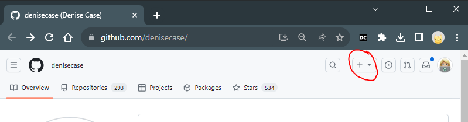

# 🟠 01b-create-repo-in-github.md

This page provides instructions to create a new repository in GitHub with a default README file.  
If the repository is created without a README, it will not work the same when cloned. If this happens, delete the repository and start over, ensuring a default README is included.

## Steps to Create a New Repository in GitHub

1. Log in to GitHub. Open your browser and log in to your GitHub account.

2. Go to the "Create Repository" Page  
   - In the top-right corner of GitHub, click the + dropdown menu.  
   - Select New repository.

3. Name Your Repository  
   - Enter a name for your new repository.  
   - IMPORTANT: Follow Naming Guidelines for Python Projects:  
     - Use all lowercase.  
     - Use dashes between words.  
     - NEVER USE spaces or special characters.  
     - Good Examples: my-python-project, python-experiments, baseball-stats, python-personal-project, website-analytics, student-impact-analysis

4. Provide a brief description of your project. This is optional but recommended.

5. Select the `Public` option so others can view your repository. You may always use a fake name.

6. IMPORTANT: Add a Default README File  
   - Check the box for Add a README file. This file is essential for cloning and initializing your project.

7. Click the `Create repository` button to finalize the process and create your repo in GitHub.

## IMPORTANT

- If you forget to add a README file, delete the repository and start over. This time, check the box to add a default README.
- The subsequent steps will NOT work the same if the new repository does not have a file in the repo already. 

## Finding the Option to Create New Repository

---

[🟠 Continue with Part 2: Project Initialization](PROJECT-INITIALIZATION.md)
